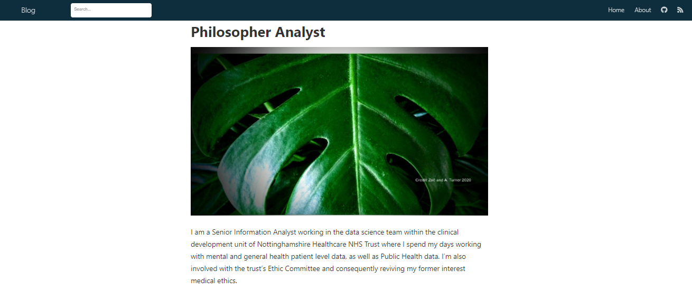

I started the distill blog before I set up this Hugo Apéro site and I love the clean look of it, particularly for technical blogs. All the pictures on this site are my own, either my drawings or photos. 

