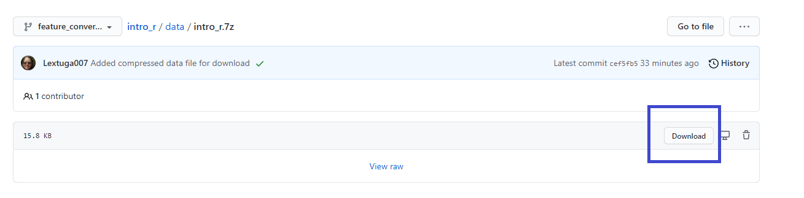

## Set up RStudio Cloud

Sign up for a free RStudio Cloud account at https://rstudio.cloud/ before the workshop. Log in with either an existing Google or GitHub account, or alternatively set up an account directly with RStudio Cloud.

NHS-R Community will send an email confirmation that will include the specific RStudio Cloud workspace invitation link. 

All the files and necessary packages are pre-loaded to the Cloud workspace.

## If you want to use your own laptop/computer

Some VPNs (Virtual Private Networks) block access to RStudio Cloud or you may wish to use your own computer. If that is the case please ensure you have the **latest** [R](https://www.r-project.org/) and [RStudio](https://rstudio.com/products/rstudio/download/) installed. 

  

It is important to have the latest R installed as older versions of R have had issues when installing tidyverse packages. [Errors](https://github.com/tidymodels/broom/issues/297) say that packages `broom` cannot be installed but even when this has been installed separately there continue to be other errors. 

If you require permission for programs to be installed on your computer and have got an older version of R and R Studio, it is worth asking for these to be updated by your IT department as this is always good practice for fixing known issues and bugs. 

### Packages

We will be using the packages tidyverse and rmarkdown, and whilst these packages are all available through CRAN and should be allowed by most organisations, if you have strict restrictions on what can be installed please have these approved or it may be better to use RStudio Cloud for the training.

## The Introduction to R and R Studio course 

We will cover installing packages but if you want, run the following code in RStudio at the command line (found in the bottom left quadrant area called 'Console'):

    install.packages(c("tidyverse", "rmarkdown"))
    
It's advisable to restart your R session before using any newly installed packages. Use the R Studio menu item *Session > Restart R* or the associated keyboard shortcut:

+ <kbd>Ctrl + Shift + F10</kbd> (Windows and Linux) or
+ <kbd>Command + Shift + F10</kbd> (Mac OS). 

#### Download the files

If you plan to use the RStudio Cloud you can still download the following files, but it's not necessary for the workshop. 

If, however, you want to use your own computer go to https://github.com/nhs-r-community/intro_r_data and click on the green <kdb>Code</kbd> button

  
  
The zip includes the data files which will be used in the workshop. I have converted the slides to be published online (see below) and made a few updates to refresh the content. 

#### Confirmation email

The NHS-R Community confirmation email will include: the link to the workshop, the RStudio Cloud workspace url and you should also receive a calendar invitation. If you are not sure that you can access zoom from your work laptop, please join a test zoom meeting coordinated by NHS-R Community.

#### Any problems

Please contact nhs.rcommunity@nhs.net if you have any issues.

#### Join the Slack group

A direct access link to the NHS-R Slack group will be shared in the workshop but the settings do allow some email addresses (like nhs.net) to sign up directly. The Slack url is [nhsrcommunity.slack.com](https://nhsrcommunity.slack.com/). Feel free to join the Slack group prior to the course!

There are channels for a wide variety of conversations including # help-with-r and # help-shiny. There is also a channel for # python and # book-club. 

Featured Art https://www.vintagevectors.com/objects/old-hot-air-balloons-and-blimps
and https://fixthephoto.com/broken-glass-overlay
