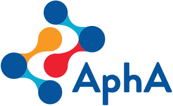

### AphA
---

### Ethics group

I started the Ethics Group in January 2021 and we hope to meet bi-monthly.

#### Invitation

When you think of data ethics often what comes to mind are research ethics or the ethics of AI. But what about the everyday ethics of data? 

As analysts we deal with data every day and there are many things that go unquestioned. Scenarios like reporting ethnicity is consistently 100% entered but in reality, only 60% is coded with ethnicity groups as the rest are coded as ‘Unknown’. Is it right to group all ethnic minorities into the group BAME when the ethnicity groups are so different and their connection in this is that they are not ‘White British’? How questions like ‘do you smoke’ feel contentious and so don’t get asked. Even the terms we use often go unquestioned like how we collect Gender data in the NHS but only the binary options of male and female are offered and so this is representing Sex, not Gender. 

And the first question we will discuss will be: Do the words "Diversity" and "inclusion" imply charity from a position of power and superiority.

Further information: 
https://blogs.bmj.com/bmj/2020/07/03/nisreen-alwan-lets-equalise-our-antiracist-language/ 
https://www.bbc.co.uk/bitesize/articles/zrvkbqt 
