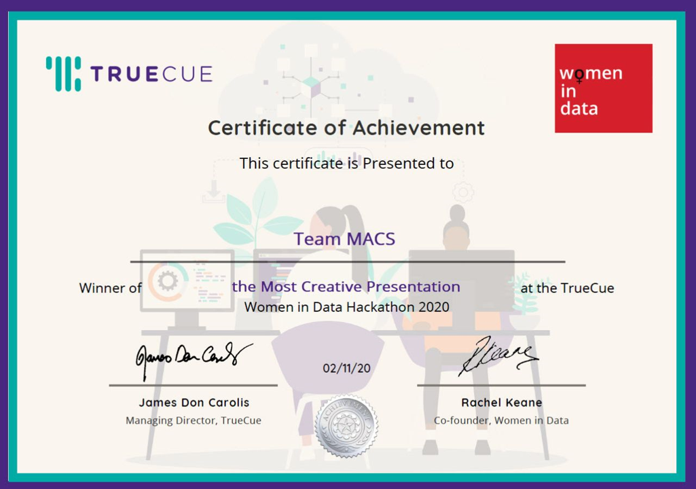

### True Cue Women in Data Hackathon 2020
---

I volunteered to help support the first True Cue Women in Data Hackathon as a facilitator. The Hackathon was a huge success with over 300 participants registered from 41 countries. I was one of 40 facilitators and I was privileged to help team MACS who won the most [creative entry](https://truecue.com/resources/blog/women-in-data-hackathon-2020-most-creative-presentation/).

### Data Sloth

I urge you to check out the 6th member of the team's short animation series created by [Anna Trichkine](https://www.linkedin.com/in/annatrichkine/) following the journey of a data loving sloth as they undertake the tasks of their data fellowship apprenticeship.

### Word from the group

Diverse in location, age and experience, Team MACS quickly identified each other's strengths and we set about coming up with our hackathon question. Our initial idea had actually been around “How has Covid-19 affected women around the world?”, and we wanted to investigate this in terms of health, work/pay, caring responsibilities, crime/domestic abuse. However, this is where we hit our first challenge. We had all gone away with a category to research and came back with the same problem – a lack of available sex disaggregated data, also known as data blackouts.

Not to be easily discouraged, Team MACS went on to turn our original question on its head, and asked “Have female leaders had a positive effect on Covid-19 outcomes in their countries?”.

As a team we all enjoyed working with people from outside of our usual work or study circles and we learned that no matter what your background, level of experience or age, there is always something to be learned from others. Some of the team used Python in their analysis and were easily able to share their knowledge when needed. It wasn't just technical skills though, we worked really well as a team, always listening to others' viewpoints and questioning insights.

One of the great things about this Hackathon was the fact that women from all over the world were able to take part, and indeed one of our own team is from China. Using the wonders of Zoom and Slack, this wasn't a problem regarding communication and we were able to keep in touch regularly, simply having to arrange meetings at a sensible time for everyone.

We all had great fun with our sixth team member, Data Sloth! Already being well versed in all things data, our animated friend helped us to present our findings in a new, creative light.

Overall we've learned a few things: Data isn't always available, and that can be frustrating; It's OK to be creative and do something a bit different with data presentation; You don't need to be afraid of feeling unprepared or out of your depth, as there are always opportunities to learn as you're going and to improve your knowledge.

