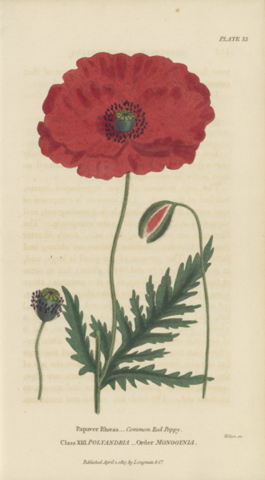

### Ethics Committee Resources
---

I have collected together the information I have been accumulating relating to data and medical ethics and, in my role as co-chair to the Nottinghamshire Healthcare NHS Foundation Trust Ethics Committee, I built the website in order to share this information. As of April 2021, the Ethics Committee will be moving from being Covid-19 specific to having a wider remit and this information is collected together to support that transition and offer resources for anyone who is interested in these subjects.
