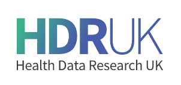

### [HDR UK](https://www.hdruk.ac.uk/)

A presentation for the HDR UK Online Careers Event where I covered my background to data science in the NHS (perhaps typical of many analysts in the NHS) and benefits to working in the NHS in this profession .

Slides created with {xaringan} and so typing c will clone the screen and p for presenter notes.

<iframe src=" https://lextuga007.github.io/Presentations/analyst-in-the-nhs/analyst-in-the-nhs.html#1" width="600" height="400" style="border:2px solid currentColor;" loading="lazy" allowfullscreen></iframe> 
