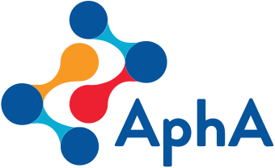

One of my first webinars for the Association of Professional Healthcare Analysts. It was a series of short talks on how analysts had found data challenges in the Covid-19 pandemic. I was reluctant speaking at first because my particular role had meant I had little involvement with this data or the challenges but I realised that I probably wasn't alone and that's what inspired my talk "Imposter syndrome in the time of coronavirus" 31:22 - 37:12, the Q&A from 1:06:58 along with the other speakers.

My one slide includes a quote from Prof David Spiegelhalter who I'd heard on Radio 4 on 30th May 2020, saying:

> Try to focus on things you do know about and shut up about everything else.

Seeing as I have never been an analyst who has done modelling, forecasting or infection monitoring I was reassured that, by not speaking about this I was being a good analyst!
