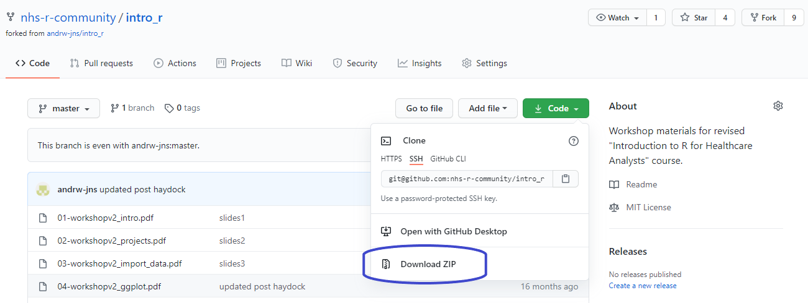

## Prework - Set up RStudio Cloud

Sign up for a free RStudio Cloud account at https://rstudio.cloud/ before the workshop. Log in with either an existing Google or GitHub account, or alternatively set up an account directly with RStudio Cloud.

NHS-R Community will send an email confirmation that will include the specific RStudio Cloud workspace invitation link. 

All the files and necessary packages are pre-loaded to the Cloud workspace.

## If you want to use your own laptop/computer

Some VPNs (Virtual Private Networks) block access to RStudio Cloud or you may wish to use your own computer. If that is the case please ensure you have [R](https://www.r-project.org/) and [RStudio](https://rstudio.com/products/rstudio/download/) installed. 

We will be using the packages tidyverse and rmarkdown, and whilst these packages are all available through CRAN and should be allowed by most organisations, if you have strict restrictions on what can be installed please have these approved or it may be better to use RStudio Cloud for the training.

The course will cover installing packages but if you want, run the following code in RStudio at the command line (found in the bottom left quadrant area called 'Console'):

    install.packages(c("tidyverse", "rmarkdown"))
    
It's advisable to restart your R session before using any newly installed packages. The keyboard shortcut for this is Ctrl+Shift+F10 or from the menu go to Session/Restart R.

### Download the files

If you plan to use the RStudio Cloud you can still download the following files, but it's not necessary for the workshop. 

If, however, you want to use your own computer go to https://github.com/nhs-r-community/intro_r and click on the green button and select Download Zip.

  
  
The zip includes the data files which will be used in the workshop, along with the pdf slides. I have converted the slides to be published online (see below) and made a few updates to refresh the content. 

## Confirmation email

The NHS-R Community confirmation email will include: the link to the workshop, the RStudio Cloud workspace url and you should also receive a calendar invitation. If you are not sure that you can access zoom from your work laptop, please join a test zoom meeting coordinated by NHS-R Community.

## Any problems

Please contact nhs.rcommunity@nhs.net if you have any issues.

## Slides

Part 1: some examples of the use of R and how to set up R Studio

<iframe src="https://lextuga007.github.io/intro_r/01-workshop_intro.html#1" width="600" height="400" loading="lazy" allowfullscreen></iframe> 

Part 2: how and why to use projects in R Studio

<iframe src="https://lextuga007.github.io/intro_r/02-workshop_projects.html#1" width="600" height="400" style="border:2px solid currentColor;" loading="lazy" allowfullscreen></iframe> 

Part 3: how to use the import wizard in R Studio and try importing example Excel spreadsheets 

<iframe src="https://lextuga007.github.io/intro_r/03-workshop_import_data.html#1" width="600" height="400" style="border:2px solid currentColor;" loading="lazy" allowfullscreen></iframe> 

RMarkdown example: [link](https://lextuga007.github.io/intro_r/intro-rmarkdown.html)

<iframe src="https://lextuga007.github.io/intro_r/intro-rmarkdown.html" width="600" height="400" style="border:2px solid currentColor;" loading="lazy" allowfullscreen></iframe>
