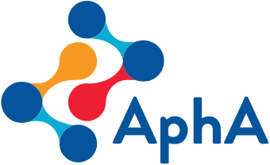

<iframe src="https://cdu-data-science-team.github.io/presentations/2022-09-27%20reproducible-analytical-pipeline/Reproducible-Analytical-Pipeline.html#1" width="600" height="400" style="border:2px solid currentColor;" loading="lazy" allowfullscreen></iframe> 
